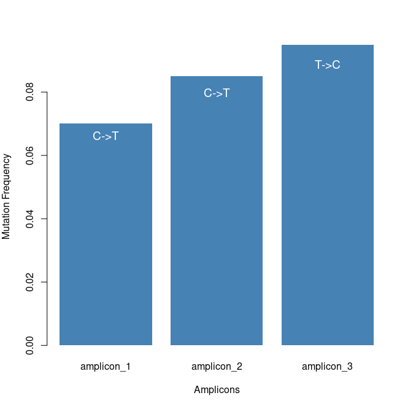

# Inivata Coding Test

The test is about Amplicon sequence mutation detection. Those amplicon sequence has been preprocessed (or maybe simulated) in `amplicon_x.fa.gz` . I need to:

1. Identify mutations existing in each amplicon file. 
2. I need to extract reference sequence from fasta file, then find out what the nature mutations are in corresponding amplicon files. 
3. An additional task is to find gene name, by maching amplicon coordinates with a gene list bed file. 
4. The instruction is not required, but since there are multiple `amplicon_x.fa.gz` files, it’s better to have a function to automate the analysis work.
5. Finally, I need to draw a barplot to show mutation frequency for each amplicon.

## 1. Mutation Detection

Since all amplicons are matched on character in string, thus I wrote [an R function](https://github.com/YuanTian1991/Inivata_Coding_Test/tree/main/S01_MutationDetection) to quickly identify mutations for each character (base) in string. The idea is based on the fact that all amplicon sequences in one file have exactly the same length, thus I can convert all sequences into a matrix, then use column functions to identify mutation.

In the below function, there is only one parameter:

- csv: The file path for amplicon, for example, `amplicon_1.fa.gz`

```r
MutationDetection <- function(csv) {

    # Read amplicons into R session.
    amplicons <- read.csv(csv, header=FALSE)[,1]
    amplicons <- amplicons[seq(2, length(amplicons), by=2)]

    # Break strings into matrix. In this case I directly use data.frame,
    # if the size is too big, data.table should be considered.
    ampliconMatrix <- t(sapply(amplicons, function(x) strsplit(x, "")[[1]]))
    rownames(ampliconMatrix) <- NULL

    # Check each column (base) for mutation detection.
    uniqueBase <- apply(ampliconMatrix, 2, function(x) length(table(x)))
    mutationBase <- which(uniqueBase != 1)

    # Count frequency for each base.
    Frequency <- sapply(mutationBase, function(x) table(ampliconMatrix[,x]))

    return(list(mutationBase=mutationBase, Frequency=Frequency))
}
```

Below is the result. After feeding with `amplicon_1.fa.gz` file,  we get the result that the mutation position is the 58th on this amplicon. On that mutation position, there are 186 C and 14 T.

```r
> result <- MutationDetection("./amplicon_1.fa.gz")
> result
$mutationBase
[1] 58

$Frequency
  [,1]
C  186
T   14

>
```

At this stage, I have not compared the sequence with reference, thus I currently don't know which one is nature, and which one is mutation.

### 1.1. Merge amplicon\_1 and amplicon\_2

One thing need to notice is that,  according to the instruction, `amplicon_1.fa.gz` should be merged with `amplicon_2.fa.gz` . I checked the coordinates for these two amplicon files, they indeed have overlaps.

Below is my results on `amplicon_2.fa.gz` file:

```r
> MutationDetection("../Data/amplicon_2.fa.gz")
$mutationBase
[1] 4

$Frequency
  [,1]
C  183
T   17

>
```

So the mutation position is at 4. **By checking the position, it’s the same base that have mutation in both these two amplicon files**.

In `amplicon_1.fa.gz` the mutation position is: 55181320 + 58 = 55181378

In `amplicon_2.fa.fz` the mutation position is: 55181374 +   4 =  55181378

Thus, to report frequency for each mutation, we should join the results from `amplicon_1.fa.gz` and `amplicon_2.fa.gz` .

```r
> Total_Base <- 186 + 14 + 183 + 17
> Frequency_C <- (186 + 183) / Total_Base
> Frequency_T <- (14 + 17) / Total_Base
> 
> Frequency_C
[1] 0.9225
> Frequency_T
[1] 0.0775
>
```

This is the frequency of two bases (C/T) in gene ENSE00001601336. 

## 2. Identify Gene Name

After figuring out how to identify mutation, my next task is to find which genes are these amplicons related to. By checking file information, I think just need to map the coordinates with the different gene bed file. Here I used `GenomicRanges` R package, which has a nice function `findOverlaps` to overlap two data.frame.

In the below function `IdentifyGene()`, there are two parameters:

- geneBed: the path to gene bed file, for example `gene1.bed`.
- coordinateBed: the path to coordinate file, for example `amplicon_coordinates.bed`.

```r
# This script identifies genes that an amplicon file belongs to.
# Author: Tian

library("GenomicRanges")

# geneBed <- "../Data/gene1.bed"
# coordinateBed <- "../Data/amplicon_coordinates.bed"

IdentifyGene <- function(geneBed, coordinateBed) {

    # Read into Gene bed file and Coordiniates bed file.
    Genes <- read.csv(geneBed, sep="\t", header=F, row.names=1)
    Coordiniates <- read.csv(coordinateBed, sep="\t", header=F, row.names=4)

    # Organize data to fit GRange transfer.
    Genes$V2 <- paste0("chr", Genes$V2)
    colnames(Genes) <- c("seqnames", "start", "end", "width")
    colnames(Coordiniates) <- c("seqnames", "start", "end")

    # Use findOverlaps to find the gene.
    ov <- as.data.frame(findOverlaps(makeGRangesFromDataFrame(Coordiniates), makeGRangesFromDataFrame(Genes)))

    return(Genes[unique(ov[,2]),])
}
```

Below are samples that how I found genes for `gene1.bed` and `gene2.bed`.

```r
> IdentifyGene("../Data/gene1.bed", "../Data/amplicon_coordinates.bed")
                seqnames    start      end width
ENSE00001601336     chr7 55181293 55181478   185
>
> IdentifyGene("../Data/gene2.bed", "../Data/amplicon_coordinates.bed")
                seqnames     start       end width
ENSE00003527888     chr7 140776912 140777088   176
>
```

As above result shows, for amplicon\_1 and amplicon\_2, the gene (gene1) related is: `ENSE00001601336` . For amplicon\_3, the gene (gene2) related is: `ENSE00003527888` .

## 3. Extract sequence from Reference

Then, I need to find a way to extract sequence from reference fasta file. After searching around, I did not find any direct tools for this solution. So I wrote a function (`getSeqFromReference`) to extract sequence. In the below function, it requires 4 parameters as input, the reference fasta file path, and `chr` , `start` and `end` for sequence you want to extract.

The idea is to use R package `seqinr` to read into reference fasta file, it will convert each chromosome string into a long vector. Then in the coordiniate file, we can find the `chr`, `start`, and `end` for each amplicon. We can then directly extract subset of vector as sequence, and convert it back from vector to string, and convert to to uppercase.

Below is the function:

- refPath is the path for reference file, in this case it’s the `genome.fa.gz` file.
- chr: chromosome of amplicon.
- start: start for amplicon.
- end: end for amplicon.

```r
library("seqinr")

getSeqFromReference <- function(refPath, chr, start, end) {

    ref <- read.fasta(file = refPath)

    idx <- which(names(ref) == chr)
    toupper(paste(ref[[idx]][start:end], collapse=""))
}
```

Below is the running result. The code successfully extracted the reference sequence for amplicon1. After extraction of reference sequence, we know the nature of mutation. For example, for amplicon 1, the 58th base is `C` in the reference sequence, thus, the nature of the mutation on base 58 is `C->T

```r
> RefSeq <- getSeqFromReference("../Data/genome.fa.gz", "chr7", 55181321, 55181390)
> RefSeq
[1] "ACCCCCACGTGTGCCGCCTGCTGGGCATCTGCCTCACCTCCACCGTGCAGCTCATCACGCAGCTCATGCC"
> substr(RefSeq,58,58)
[1] "C"
```

Actually, I think this solution is not very efficient. It’s better to directly manipulate string sequence. If this functionality is vital for my future work, I will seek a faster way.

## 4. Wrap up into a general function: AmpliconAnalysis()

In above three sections, I have shown how I 1): Find mutation from a list of amplicon sequence; 2): Get gene name by overlapping candidate gene bed file with coordinate files and 3): Get reference sequence to decide nature of mutation. Now I want to wrap them up into a function.

The function is just an integration of above 3 functions, and contains some data organisation for mutation information. The full code is [here](https://github.com/YuanTian1991/Inivata_Coding_Test/blob/main/AmpliconAnalysis.R). The function is. It contains 5 parameters:

- ampliconFile: path to amplicon sequence file.
- referenceFile: path to reference sequence file.
- geneBed: path to gene bed file.
- coordinateBed: path to coordinate bed file.
- ampliconID: An string match the amplicon file.

After wrapping, I can easily run analysis across all amplicon files like:

```r
source("./AmpliconAnalysis.R")

amplicon1Result <- AmpliconAnalysis("./Data/amplicon_1.fa.gz",
                                    "./Data/genome.fa.gz",
                                    "./Data/gene1.bed",
                                    "./Data/amplicon_coordinates.bed",
                                    "amplicon_1")

amplicon2Result <- AmpliconAnalysis("./Data/amplicon_2.fa.gz",
                                    "./Data/genome.fa.gz",
                                    "./Data/gene1.bed",
                                    "./Data/amplicon_coordinates.bed",
                                    "amplicon_2")

amplicon3Result <- AmpliconAnalysis("./Data/amplicon_3.fa.gz",
                                    "./Data/genome.fa.gz",
                                    "./Data/gene2.bed",
                                    "./Data/amplicon_coordinates.bed",
                                    "amplicon_3")
```

The result for each amplicon looks like blow. It clearly shows all required attributes. Below the example for `amplicon_1.fa.gz`.

```r
> amplicon1Result
$geneName
[1] "ENSE00001601336"

$natureMutation
[1] "C->T"

$mutationFrequency
   T
0.07

$mutationAmpliconNumber
 T
14

$referenceSequence
[1] "ACCCCCACGTGTGCCGCCTGCTGGGCATCTGCCTCACCTCCACCGTGCAGCTCATCACGCAGCTCATGCC"

$mutationSequence
[1] "ACCCCCACGTGTGCCGCCTGCTGGGCATCTGCCTCACCTCCACCGTGCAGCTCATCATGCAGCTCATGCC"

$mBases
[1] 58

>
```

Now I want to organise them all into a table. **Note that the result from these 3 amplicon can be organised into a table because they contain only 1 mutation.** The result table is below. I also exported it into a csv file as instructed.

```r
> knitr::kable(resultTable)

|                       |amplicon1Result                                                        |amplicon2Result                                              |amplicon3Result                                              |
|:----------------------|:----------------------------------------------------------------------|:------------------------------------------------------------|:------------------------------------------------------------|
|geneName               |ENSE00001601336                                                        |ENSE00001601336                                              |ENSE00003527888                                              |
|natureMutation         |C->T                                                                   |C->T                                                         |T->C                                                         |
|mutationFrequency      |c(T = 0.07)                                                            |c(T = 0.085)                                                 |c(C = 0.095)                                                 |
|mutationAmpliconNumber |c(T = 14)                                                              |c(T = 17)                                                    |c(C = 19)                                                    |
|referenceSequence      |ACCCCCACGTGTGCCGCCTGCTGGGCATCTGCCTCACCTCCACCGTGCAGCTCATCACGCAGCTCATGCC |TCACGCAGCTCATGCCCTTCGGCTGCCTCCTGGACTATGTCCGGGAACACAAAGACAATA |CAAAAATAATTTACAAGACATTTAACGAATGGAACTTACTCCATGCCCTGTGCAGTCTGT |
|mutationSequence       |ACCCCCACGTGTGCCGCCTGCTGGGCATCTGCCTCACCTCCACCGTGCAGCTCATCATGCAGCTCATGCC |TCATGCAGCTCATGCCCTTCGGCTGCCTCCTGGACTATGTCCGGGAACACAAAGACAATA |CAAAAATAACTTACAAGACATTTAACGAATGGAACTTACTCCATGCCCTGTGCAGTCTGT |
|mBases                 |58                                                                     |4                                                            |10                                                           |
>
```

Also, I drew a barplot (extra task) to show mutation frequency in three amplicons, and labelled the mutations on the bars.



## 5. Run amplicon\_3.test\_2.fa.gz

The final task is to run `amplicon_3.test_2.fa.gz` file. This amplicon contains two mutation. My function `AmpliconAnalysis()` can deal with multiple mutations perfectly. So I just need one command to finish the job:

```r
amplicon3_2 <- AmpliconAnalysis("./Data/amplicon_3.test_2.fa.gz",
                                "./Data/genome.fa.gz",
                                "./Data/gene2.bed",
                                "./Data/amplicon_coordinates.bed",
                                "amplicon_3")
```

The result is below, in a R list. I firstly plotted the gene name and reference sequence, then I show the two mutation identified. One is at 10th base (T→C), and the other is at 55th base (G-A) 

```r
> amplicon3_2[c(1,5)]
$geneName
[1] "ENSE00003527888"

$referenceSequence
[1] "CAAAAATAATTTACAAGACATTTAACGAATGGAACTTACTCCATGCCCTGTGCAGTCTGT"

>
> knitr::kable(do.call("rbind", amplicon3_2[c(2,3,4,6,7)]))
|                       |C                                                            |A                                                            |
|:----------------------|:------------------------------------------------------------|:------------------------------------------------------------|
|natureMutation         |T->C                                                         |G->A                                                         |
|mutationFrequency      |0.105                                                        |0.025                                                        |
|mutationAmpliconNumber |21                                                           |5                                                            |
|mutationSequence       |CAAAAATAACTTACAAGACATTTAACGAATGGAACTTACTCCATGCCCTGTGCAGTCTGT |CAAAAATAATTTACAAGACATTTAACGAATGGAACTTACTCCATGCCCTGTGCAATCTGT |
|mBases                 |10                                                           |55                                                           |
>
```

## Summary

This is a very good coding test among all coding test I have done, which involved with file processing, string manipulation, data organising, and automation with function. 

To address this test, I wrote a function `AmpliconAnalysis()` to preprocess amplicon files along with reference/gene files all together, and return all mutations existing in each amplicon files.

